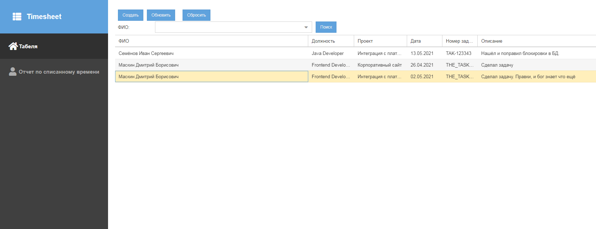
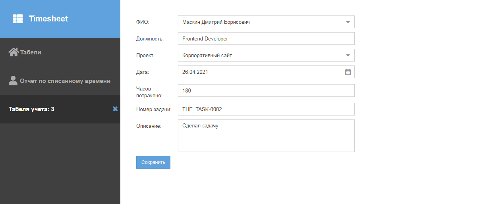
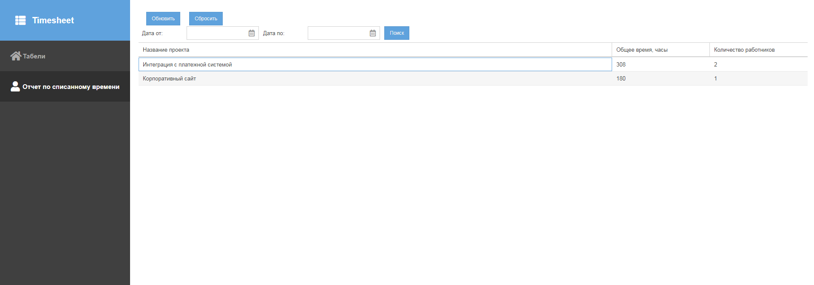

#Табель учета времени сотрудника

​

## О проекте
Проект представляет из себя веб-форму для заполнения полей табеля учета времени сотрудника

Состоит из 2-х разделов:

1. Табели
2. Отчет по списанному времени

### 1.  Табели

Таблица с записями сотрудников о списанном времени. Поддерживает пагинацию (на бэке).
Так же поддерживается фильтрация по работнику (комбобокс вверху)

В таблице есть кнопки для создания новой записи, либо редактирования существующей (при двойном клике)

#### Заполнение табеля

​

табель содержит в себе следующие поля:
ФИО, должность, дата, проект, задача в проекте, время на нее потраченное

### 2. Отчет по списанному времени

​

Представляет аггрегированную информацию по заведённым проектам, в виде:

1. Название проекта
2. Общее количество часов, потраченных сотрудниками
3. Количество работников, занимающихся проектом.

Так же поддерживается фильтрация по "Дате от" и "Дате по".

## Запуск приложения

Для запуска потребуетя
1. **Java 8** или выше
2. maven 3.3.9 или выше. Либо встроенный в Intellij Idea
3. БД **PostgreSQL** 10 или выше.

Шаги для запуска.

1. Выполнить команду   
    >**mvn clean install**

2. Создать БД  
    >CREATE DATABASE timesheet  
        WITH  
        OWNER = postgres  
        ENCODING = 'UTF8'  
        CONNECTION LIMIT = -1;  
        
3. Сконфигурировать подключение к БД в **application.properties**  
        
4. Запустить  
    >java -jar target/timesheet-1.0-SNAPSHOT.jar

#### Приложение можно открыть по ссылке:
http://localhost:8080/Timesheet/

## Описание API

1. Список табелей
http://localhost:8080/api/timesheet/getAll  
POST  
{"userId":2,"page":1,"start":0,"limit":25}

2. Обновление табеля
http://localhost:8080/api/timesheet/updateTimesheet  
PUT  
{"id":2,"employeId":2,"lastName":"Маскин","firstName":"Дмитрий","middleName":"Борисович","position":"Frontend Developer","projectId":3,"projectName":"Интеграция с платежной системой","workDate":"2021-05-01T19:00:00.000Z","taskNum":"THE_TASK-0001","taskDescription":"Сделал задачу. Правки, и бог знает что ещё","timeWasted":300}

3. Создание табеля
http://localhost:8078/api/timesheet/createTimesheet  
POST  
{"workDate":"2021-05-13T21:02:12.525Z","id":-1,"employeId":2,"projectId":3,"position":"Frontend Developer","timeWasted":"8","taskNum":"TASK-0000","taskDescription":"Description"}

4. Справочник сотрудников
http://localhost:8080/api/employe/getAll  
POST  
{}  

5. Справочник проектов
http://localhost:8080/api/project/getAll  
POST  
{}

6. Отчёт по списанному времени.
http://localhost:8080/api/timesheet/getCommonReport  
POST  
{"start":"2021-04-30T19:00:00.000Z","end":"2021-05-13T19:00:00.000Z","page":1,"limit":25}
